# Unit-21-Homework-Martian-Token-Crowdsale

## ASSIGNMENT 
---
---

`I was selected by The Martian Aerospace Agency selected to become part of the first human colony on Mars. As a prominent fintech professional, i was chosen to lead a project developing a monetary system for the new Mars colony. I decided to base this new system on blockchain technology and to define a new cryptocurrency named KaseiCoin. (Kasei means Mars in Japanese.)
KaseiCoin will be a fungible token that’s ERC-20 compliant. I launched a crowdsale that will allow people who are moving to Mars to convert their earthling money to KaseiCoin.`

## Instructions
The steps for this assignment are divided into the following subsections:

1) Create the KaseiCoin Token Contract

2) Create the KaseiCoin Crowdsale Contract

3) Create the KaseiCoin Deployer Contract

4) Deploy and Test the Crowdsale on a Local Blockchain

## Step 1:
---

`Creating  the KaseiCoin Token Contract.`
---

In this subsection, I created a smart contract that defines KaseiCoin as an ERC-20 token. To do so,  I completed the following steps:

1) Imported the provided KaseiCoin.sol starter file into the Remix IDE.

2) Import the following contracts from the OpenZeppelin library:

ERC20

ERC20Detailed

ERC20Mintable

3) Defined a contract for the KaseiCoin token, and named it KaseiCoin. I had the contract inherit the three contracts that I imported from OpenZeppelin.

4) Inside the KaseiCoin contract, i added a constructor with the following parameters: name, symbol, and initial_supply.

5) As part of your constructor definition, I added a call to the constructor of the ERC20Detailed contract, passing the parameters name, symbol, and 18. 

6) I compiled the contract by using compiler version 0.5.5.
---
---

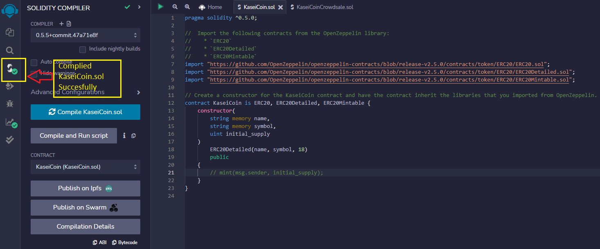
---
---

## Step 2: 
`Create the KaseiCoin Crowdsale Contract`
---

 In this subsection, I defined the KaseiCoin crowdsale contract. To do so, I completed the following steps:

1) Imported the provided KaseiCoinCrowdsale.sol starter code into the Remix IDE.

2) Had this contract inherit the following OpenZeppelin contracts:

* Crowdsale

* MintedCrowdsale

3) In the KaisenCoinCrowdsale constructor, I provided parameters for all the features of the crowdsale, such as rate, wallet (where to deposit the funds that the token raises), and token. I configured these parameters as I wanted for the KaseiCoin token.

4) Compiled the contract by using compiler version 0.5.5.

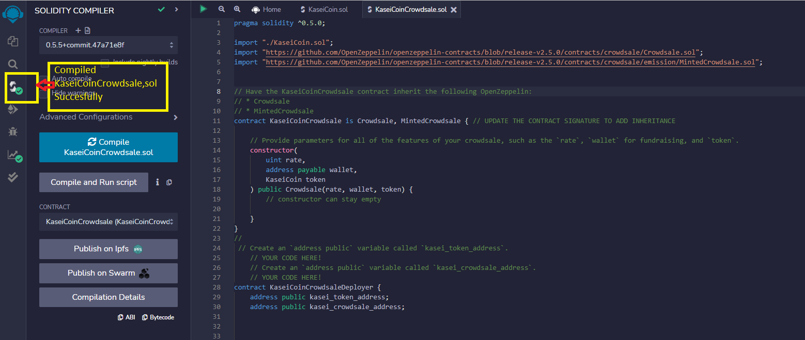

## Step 3:
` Created the KaseiCoin Deployer Contract`
---
In this subsection, I created the KaseiCoin deployer contract. I started by uncommenting the KaseiCoinCrowdsaleDeployer contract in the provided KaseiCoinCrowdsale.sol starter code.
Next, in the KaseiCoinCrowdsaleDeployer contract, I added variables to store the addresses of the KaseiCoin and KaseiCoinCrowdsale contracts, which this contract will deploy. Finally, I completed the KaseiCoinCrowdsaleDeployer contract. To do so, i had to complete the following steps:

1) Created an address public variable named kasei_token_address, which will store the KaseiCoin address once that contract has been deployed.

2) Created an address public variable named kasei_crowdsale_address, which will store the KaseiCoinCrowdsale address once that contract has been deployed.

3) Added the following parameters to the constructor for the KaseiCoinCrowdsaleDeployer contract: name, symbol, and wallet.

4) Inside of the constructor body (that is, between the braces), I completed the following steps:

* Created a new instance of the KaseiCoinToken contract.

* Assigned the address of the KaseiCoin token contract to the kasei_token_address variable. (This allowed me to easily fetch the token's address later.)

* Created a new instance of the KaseiCoinCrowdsale contract by using the following parameters:

* `The rate parameter: Set rate equal to 1 to maintain parity with ether.`

* `The wallet parameter: Passed in wallet from the main constructor. This is the wallet that will get paid all the ether that the crowdsale contract raises.`

* `The token parameter: Made this the token variable where KaseiCoin is stored.`

* `Assigned the address of the KaseiCoin crowdsale contract to the kasei_crowdsale_address variable. (This allowed me to easily fetch the crowdsale’s address later.)

* `I Set the KaseiCoinCrowdsale contract as a minter.`

*`Had the KaseiCoinCrowdsaleDeployer renounce its minter role.`

* `Compiled the contract by using compiler version 0.5.5.`
---
---

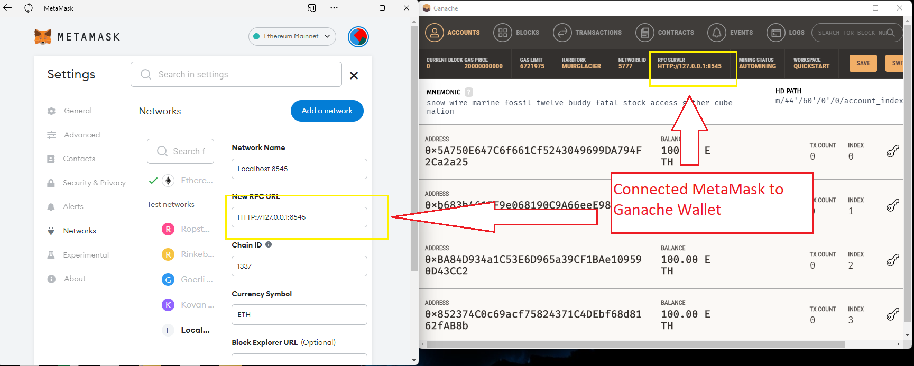

---
---
---
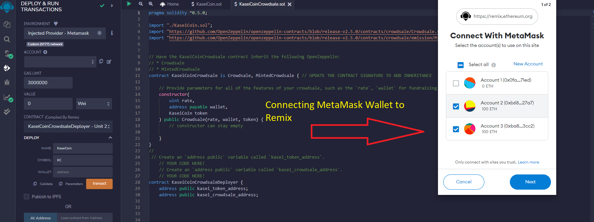
---
---
---
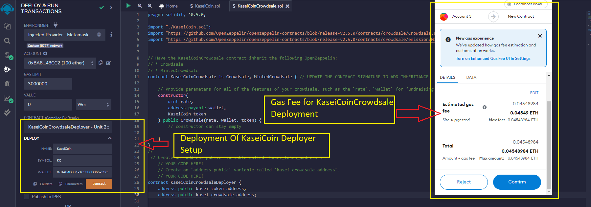
---
---
---

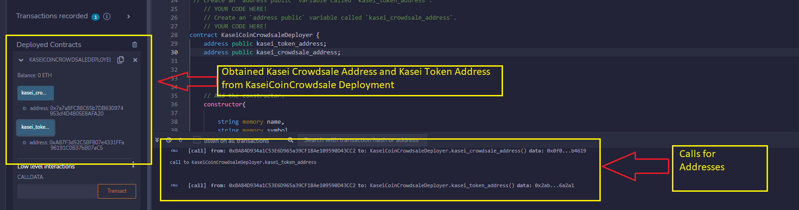
---
---
---
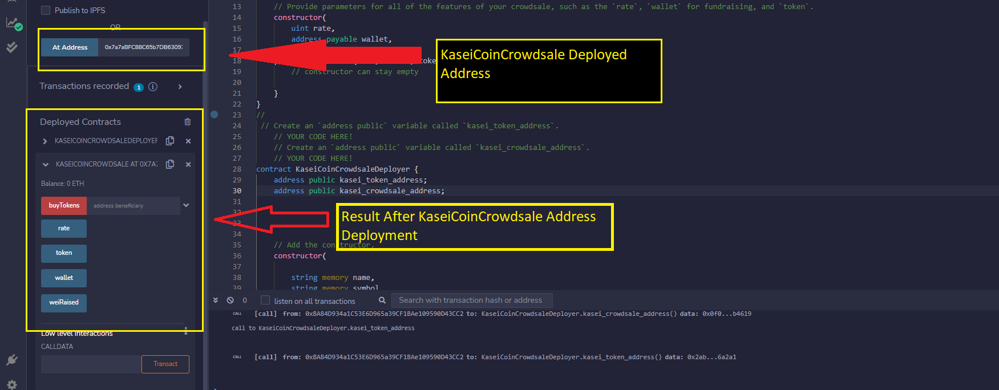
---
---
---
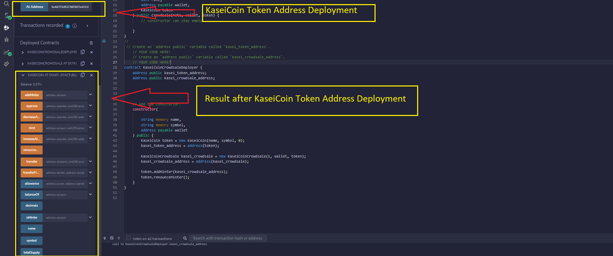
---
---
---

## Step 4: 
`Deploy and Test the Crowdsale on a Local Blockchain`
---

1) I deployed the crowdsale to a local blockchain. I then performed a real-world, pre production test of the crowdsale. 

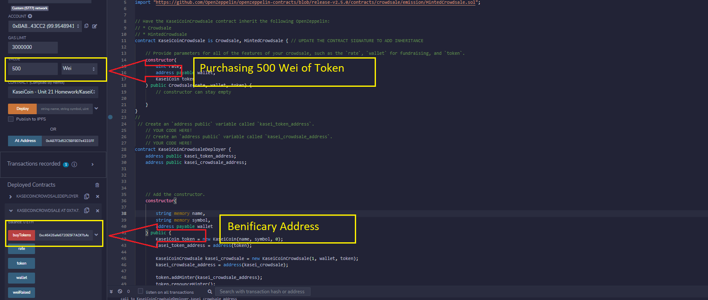
---
---
---
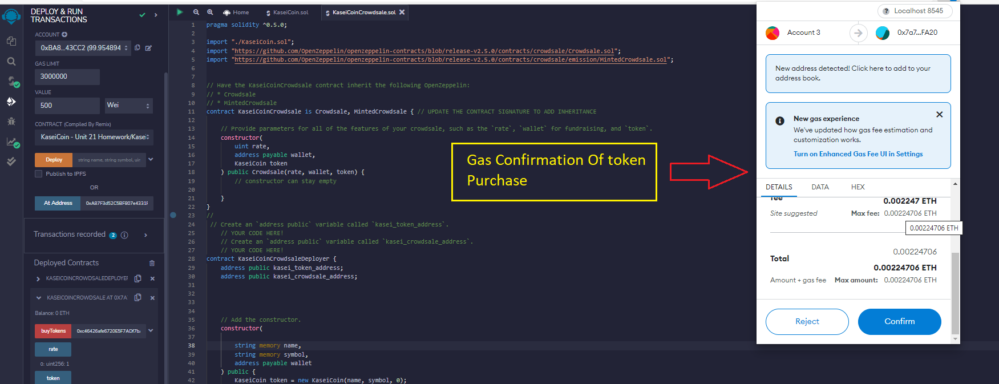
---
---
---
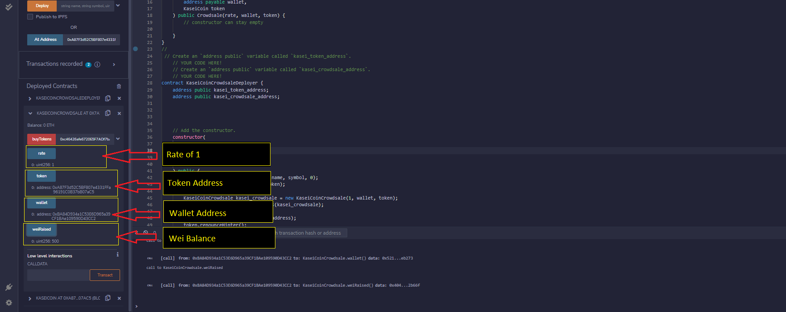

